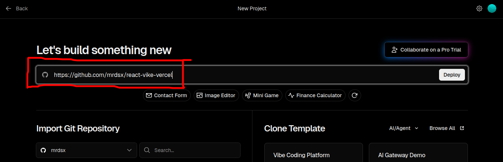

# react-vike-vercel

## How to deploy

1. Log in to your [Vercel](https://vercel.com/) account (or create one).
2. Copy THIS repository URL (https://github.com/mrdsx/react-vike-vercel) to new project page on Vercel.

3. `Application preset` must be `Vite` (Vercel should automatically set Vite; just make sure preset is correct).
4. Set `Build and Output Settings` > `Output Directory` to `dist/client`.
5. Click `Deploy`.

After performing such steps you should see web site with home page and about page.
